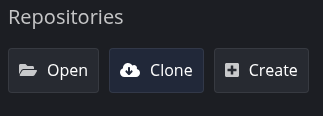
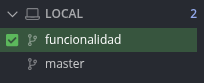

# Proyecto — Mejoras implementadas

## Funcionalidades añadidas
- Añadido mayor tamaño medio de bolas.
- Subida de velocidad de las bolas al caer.
- Añadidas 7 vidas.

## Proceso de creación del fork y trabajo con GitKraken
1. Hice **fork** del repositorio original del profesor en GitHub.
2. Cloné mi fork con **GitKraken** usando la opción *Clone a repo*.
3. Creé una nueva rama llamada `funcionalidad`.
4. Añadí las nuevas funcionalidades y realicé **commit + push**.
5. Fusioné la rama `funcionalidad` con `main`.
6. Finalmente, subí los cambios con **push** a GitHub.

## Capturas de pantalla
### 1. Fork del repositorio

### 2. Creación de la rama en GitKraken

